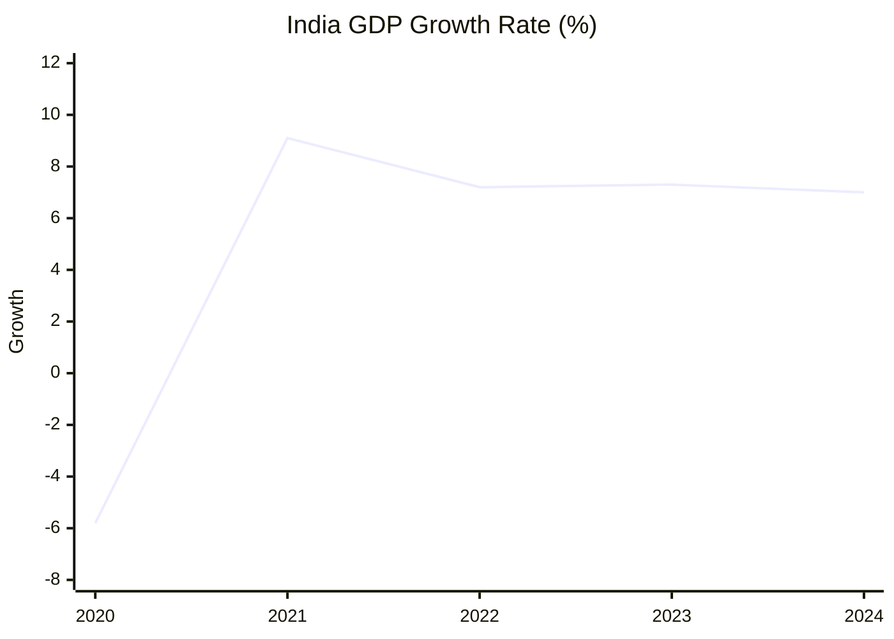

# The Indian Monsoon

The climate of India is heavily influenced by the monsoon winds. The word monsoon comes from the Arabic word *mausim*, meaning season.

### Visual Monsoon Guide

## Important Factors
* **Differential Heating:** Land heats up and cools down much faster than water.
* **ITCZ:** The shift of the Inter Tropical Convergence Zone over the Ganga plain in summer.

## Economic Trends: GDP Growth

